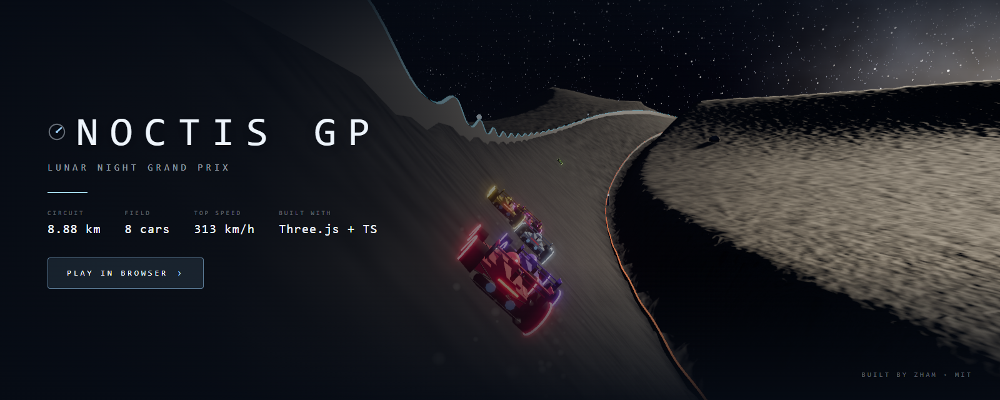
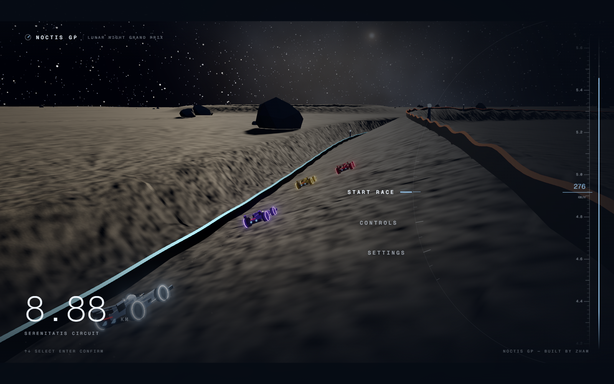
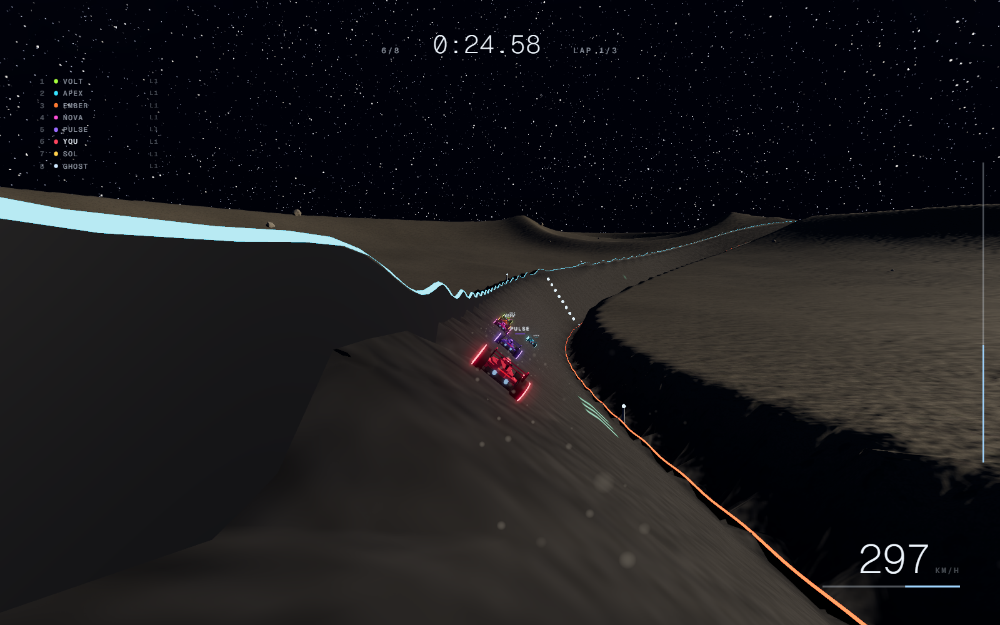
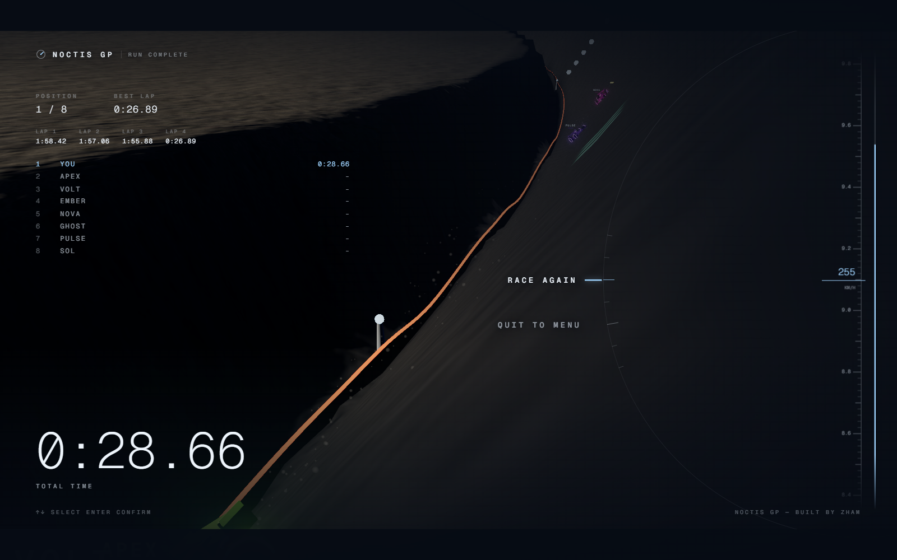
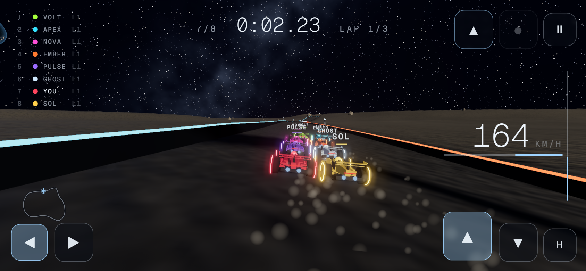

# NOCTIS GP

### ▶ Play it live: **https://zhameersheraz.github.io/Noctis-GP/**

[](https://zhameersheraz.github.io/Noctis-GP/)
[](https://threejs.org/)
[](https://www.typescriptlang.org/)
[](LICENSE)
[](https://github.com/zhameersheraz)



A lunar night grand prix in the browser. Eight maglev open-wheelers, three laps
of the 8.88 km Serenitatis circuit, power-ups, and a low sun raking across a
procedurally sculpted Mare-style landscape.

Built by **zham**. Built with **Three.js + TypeScript + Vite**. No model, texture
or audio assets: the cars, the terrain, the sky, the Earth and the entire
soundtrack are all generated at runtime.

## Screenshots

Every image in this README is a real frame captured from the deployed site on a
GPU, not a generated picture. The hero banner is one of those frames with the
overlay UI stripped out and a title block laid over it; the body shots are
untouched.

| Menu | Race |
| --- | --- |
|  |  |



## Plays on a phone

There is no keyboard required. Touch devices get on-screen controls — steering
on the left, throttle/brake/handbrake on the right, boost, power-up and pause
along the top — and the menu becomes a thumb-sized toolbar instead of the
desktop arc dial.



Real multi-touch: steering while holding the throttle is the one thing a racer
does constantly, so each button captures its own pointer and lifting one thumb
never cancels the others. Tapping the power-up fires it once even if the press
starts and ends between two frames. The controls only appear on devices that
actually report touch, so they never cover the HUD on desktop.

Portrait works too — you just get a nudge to turn the device sideways.

## Catch-up instead of a difficulty menu

There is no Easy / Medium / Hard. In an arcade racer a difficulty setting is
the wrong lever: the thing that strands a new player is not that the AI is
quick, it is that the pack disappears over the horizon and there is nothing
left to race. Slowing every rival does not stop you losing to a banana, and it
is a decision you have to make before you have driven once.

So rivals adjust their pace from their gap to you instead — leaders ease off
slightly, cars behind press on. Invisible, no menu, helps a beginner without
punishing an expert.

Measured by the race verifier, player driving at 88% of normal pace:

| | worst gap to the leader |
| --- | --- |
| catch-up off | 2011 m |
| catch-up on | **692 m** |

The easing is deliberately stronger (16%) than the pushing (5%), and only ever
applies to cars *ahead* of you — so a car in front can still win, and a player
doing well gets no help at all.

## Credits

- **Built by [zham](https://github.com/zhameersheraz).**
- The arc-dial menu, letterbox framing, instrument-cluster HUD, attract-loop
  camera and maglev handling model follow
  [NOCTIS GP](https://nrjx43j36adhu.ok.kimi.link). That started out as a
  Kimi AI-generated template, so there is no individual author to credit —
  the link is there so the lineage of the design is clear rather than
  mysterious.
- Everything else here — the circuit, terrain, AI, physics implementation and
  verification harness — is original to this repo.
- Three.js, Vite, TypeScript. No other runtime dependencies and no asset files
  of any kind.

## Run it

```bash
npm install
npm run dev        # http://localhost:5173
```

Production build and preview:

```bash
npm run build
npm run preview
```

## Deploy to GitHub Pages

The build is a plain static site, and `vite.config.ts` already uses
`base: './'`, so it works from a project subpath with no extra configuration.

```bash
git init
git add .
git commit -m "NOCTIS GP - lunar night grand prix"
git branch -M main
git remote add origin https://github.com/zhameersheraz/Noctis-GP.git
git push -u origin main
```

Then in the repo: **Settings → Pages → Build and deployment → Source: GitHub
Actions**. This one-time toggle is required: GitHub will not let the Actions
token create a Pages site on a brand new user repository, so the very first
run always reports `Get Pages site failed` until you flip it. Every push after
that deploys with no further input.

Your game will be live at:

```
https://zhameersheraz.github.io/Noctis-GP/
```

First run takes a minute or two while GitHub provisions Pages. Re-running it
manually is just **Actions → Deploy to GitHub Pages → Run workflow**.

## Controls

| Key | Action |
| --- | --- |
| `W` / `↑` | Throttle |
| `S` / `↓` | Brake / reverse |
| `A` `D` / `←` `→` | Steer |
| `Shift` | Boost (drains the meter) |
| `Space` | Handbrake |
| `Q` / `E` | Use power-up |
| `R` | Put the car back on the racing line |
| `Esc` | Pause / back |

On the menus, `↑ ↓` select, `Enter` confirms, `‹ ›` adjust, `Esc` goes back.

## URL parameters

| Parameter | Effect |
| --- | --- |
| `?race=1` | Skip the menu and start a race automatically (soak testing) |
| `?demo=1` | Let the AI drive your car, including firing your power-ups |

---

## How it is put together

The central design rule is that **the rules do not know about rendering**. Every
number the physics uses lives in a plain class that never touches the DOM, which
is what makes the game testable outside a browser.

```
src/
  core/       math, noise, liveries              (pure)
  sim/        terrain, track, car, ai, items, race   (pure rules, no DOM)
  render/     world, sky, cameras, dust, carMesh     (THREE only)
  audio/      RaceAudio                               (WebAudio only)
  ui/         menu + HUD                              (DOM only)
  main.ts     bootstrap, input, frame loop
tools/        headless verifiers and the browser playtest
```

### The terrain is the single source of truth

`sim/terrain.ts` owns one `Float32Array` of heights. The render mesh is built
from it, the circuit is carved into it, and the vehicle physics samples it
bilinearly. The road you see is literally the surface you drive on.

### Grading the road

Raw terrain noise carries several metres of high-frequency energy — far more
than the designed launch ramp — so sampling it directly produces a profile that
throws the car around and completely buries the jump. A real circuit is graded,
so `Track.setHeightsFromTerrain` does this in four stages:

1. sample the terrain,
2. **subtract** the designed ramp, so heavy smoothing cannot eat it,
3. smooth hard (three box passes), which removes terrain noise but keeps the
   crater and the big climbs,
4. add exactly **one** clean ramp back, then erode any remaining unintentional
   crests that would launch the car.

The launch ramp is anchored to a world position, not an arc length, so editing
the control ring can never silently move it off the racing surface.

### The launch kicker

A single Gaussian ramp sounds right and is not. Measured, it produced **0.2 s
of air** — a kerb bounce, not a jump. The reason is that airtime is set by how
much height the car has to fall back through, and a symmetric bump spends half
its amplitude climbing back up, so the ground catches the car on the way.

The shipped ramp is a **kicker**: two Gaussians joined at the apex, a 36 m
approach and a tighter 24 m landing side. Amplitude buys float and a tight
approach buys launch, so one parameter buys both. Every car in the field now
gets 0.9-1.0 s of air off it, and the headless race confirms it three times a
race with nobody leaving the road.

Both halves are plain Gaussians deliberately. An earlier open-ended profile
that stayed high for hundreds of metres had to be cut off somewhere, and that
cut showed up as a **160% cliff** in the road gradient.

### The maglev model

Downforce is proportional to `speed²` and is **released over crests**. That one
behaviour does two things at once:

- the car sticks to a 56° banking at speed,
- and it genuinely goes ballistic over the kicker, because the centripetal
  demand at the crest exceeds gravity plus whatever downforce the current
  speed can generate.

At the racing speeds the AI actually carries (~80 m/s) the demand at the apex
is 22.9 m/s² against a release ceiling of 18.7, so the maglev fully lets go
rather than only skimming. The verifier asserts that inequality directly,
because a ramp that is merely *almost* steep enough is indistinguishable from
no ramp at all.

The AI reasons with the *same* lateral-acceleration budget the simulation uses,
which is why it brakes exactly when the physics says it has to. There is no
hidden rubber-banding.

### Selective bloom

Rather than letting the whole frame bloom (which blows out sunlit bodywork and
regolith), the frame is rendered twice: once with every non-emissive object
swapped for flat black so only bloom-marked materials contribute, and once
normally. The two are summed. Materials opt in by being emissive, which they
signal with `toneMapped: false`.

### No-GPU fallback

If the browser falls back to a CPU rasteriser (SwiftShader, llvmpipe, Mesa
software), the game detects it and drops shadows, bloom and pixel ratio rather
than crawling at one frame per second.

---

## Verification

This project ships with three verification layers. All of them run the *real*
shipped code, not a re-implementation.

```bash
npm run typecheck      # tsc --noEmit, strict
npm run verify         # circuit geometry
npm run verify:race    # headless full-race simulation
npm run verify:pages   # boots the build from a GitHub Pages style subpath
npm run verify:mobile  # emulated phone: multi-touch, menus, touch targets
npm run playtest       # real browser, real Chrome (after npm run build)
```

### `npm run verify` — circuit geometry

Asserts the circuit is a real circuit: no self-intersection, a sane minimum
radius, a drivable maximum gradient, a banking angle inside the buildable
range, a launch ramp that is genuinely convex and genuinely launches a fast car,
and that the carved terrain at the rail foot meets the road plane (otherwise a
gap opens under the barrier wall on deep cuttings).

### `npm run verify:race` — headless full race

Drives the real `RaceDirector` with the real terrain, track, car physics, AI and
power-up field, and asserts that a full three-lap race is completable: every
car takes the flag, nobody goes off, lap times are plausible and consistent,
the field finishes together, the ramp is actually jumped, attract mode is
stable, and restarting reproduces the grid.

### `npm run verify:pages` — deployment check

Serves the build one directory down and loads it the way GitHub Pages serves a
project repo, then asserts the bundle resolves, the stylesheet actually
applied, the scene renders and the console stays clean. A relative-path build
is easy to assume and easy to get wrong; this checks it.

### `npm run verify:mobile` — touch controls

Emulates a phone and drives the game with real dispatched touch events, then
asserts the things that only break on a touchscreen: that both a steering press
and a throttle press register at the same time, that lifting one thumb leaves
the other held, that every control clears the 44 px touch target and sits
inside the viewport, that a sub-frame tap still fires, that the on-screen pause
works, and that the desktop build shows no touch controls at all and still
drives from the keyboard.

### `python tools/playtest.py` — browser

Launches real Chrome, walks the menu, starts a race, holds throttle, steers,
boosts, pauses, picks up and fires a power-up, jumps the ramp, reaches the
results board, quits, restarts, resets the car and resizes the window. It also
reads the framebuffer back to confirm the scene is actually drawing rather than
being a black rectangle, and fails on any console error.

Because headless Chrome has no GPU, gameplay is advanced with
`window.NOCTIS.stepSim()`, which runs the same input read and the same
`RaceDirector.update` as the render loop — just without waiting for pixels.
Rendering is verified separately by screenshotting real frames into
`playtest/`.

### Debug hooks

`window.NOCTIS` exposes `{ world, track, terrain, director, audio, menu, sky, stepSim, snapCamera }`
for poking at a running game from the console. `window.__fps`, `window.__errors`
and `window.__game` are also available for automated tests.

---

## What the verification actually caught

None of these were found by reading the code. They are listed because they are
the reason the harness exists.

| Defect | Symptom | How it surfaced |
| --- | --- | --- |
| Terrain noise buried the jump | Ramp profile was **16.2 m of noise** against a 4.2 m design — the jump did not exist in the geometry | Geometry verifier: vertical curvature came out positive, i.e. a valley |
| Carve blend never reached 1.0 | A **5.7 m gap opened under the barrier wall** wherever the circuit cut deep into a crater | Geometry verifier: sampled the carved terrain at the rail foot against the road plane |
| `dt` used out of scope in `resolveBarriers` | Rail friction was `NaN`, so cars never scrubbed speed on contact | `tsc --noEmit` |
| Attract pack frozen | The menu had a completely stationary field, because a stray `disabled = true` was left in the attract spawn | Browser playtest: "pack leader at 0 km/h" |
| Power-up could never fire | Edge detection tested the *function reference*, which is permanently truthy, so the key was always "already held" | Browser playtest: item slot never emptied |
| Open-ended ramp profile | **160% gradient** — a cliff across the road | Geometry verifier, after the ramp was reshaped |
| Missing favicon | Two 404s in the console | Browser playtest console check |
| `file://` harness | Playtest reported a black screen for five minutes; the module had never loaded, because Chrome blocks ES modules over `file://` | Boot probe printing `loader=False, NOCTIS=False` |

Two more were *checks* that were wrong rather than the game: a curvature
formula that was off by a factor of 20, and a "trench" metric that was really
measuring the banking. Both are noted in `tools/validate.ts`, because a verifier
that lies is worse than no verifier.
